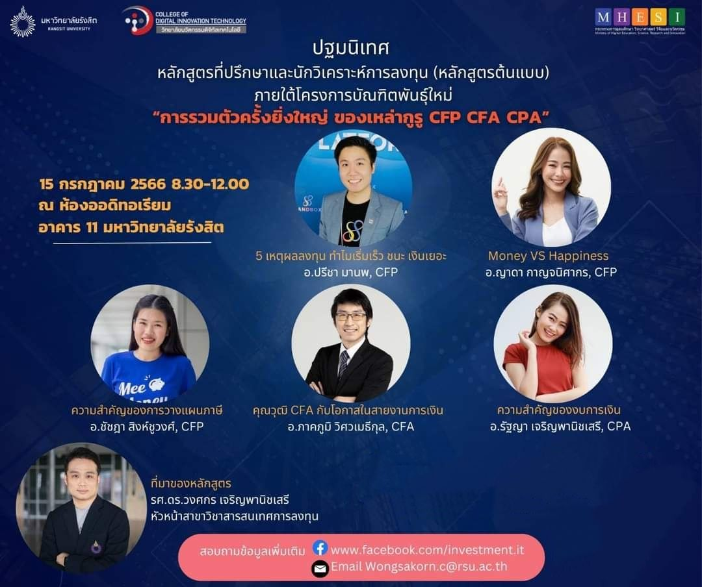
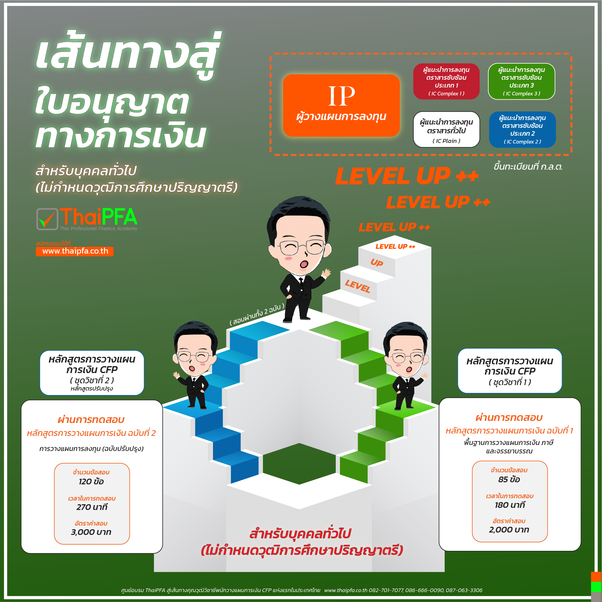

# Investment Consultant and Investment Analyst Program - หลักสูตรที่ปรึกษาและนักวิเคราห์การลงทุน💰💹👨🏻‍💼

## [รวมเอกสารประกอบการเรียน](https://drive.google.com/drive/u/0/folders/1QvC8QIbk9nQDsIE0jqerX5vrnNFt-yqp)

| #  |     Date      | Subjects | Instructors | เอกสารประกอบการสอน |
|----|---------------|----------|----------|----------|
| 1  | Jul 15, 2013  | - ที่มาของหลักสูตร   - [Money VS Happiness](https://drive.google.com/file/d/13sx80zUBw0RiWIcK7AHW3R2BLchTU6Zu/view?usp=sharing)   - [ความสำคัญของการวางแผนภาษี](https://drive.google.com/file/d/1bo48siXhfmEFO6lU8by6hDri2jS5snmj/view?usp=sharing)   - [5 เหตุผลลงทุน ทำไมเริ่มเร็ว ชนะ เงินเยอะ](https://drive.google.com/file/d/10Iar_EPrD2rSbfChaxjFdJgmdLcH2eP9/view?usp=sharing)   - [คุณวุฒิ CFA กับโอกาสในสายงานการเงิน](https://drive.google.com/file/d/11mHBOVzcbGQ0TESOy-VMEXVlWiy8uS-b/view?usp=sharing)   - [ความสำคัญของงบการเงิน](https://drive.google.com/file/d/1Z_6d8UPQzGNdWOmSnis8XMTlsoWS3fFF/view?usp=sharing) | [Wongsakorn Charoenpanitseri, CFP](https://www.linkedin.com/in/wongsakorn-charoenpanitseri-0130431b4/?originalSubdomain=th)   [Yada Karnjanisakorn, CFP](https://www.linkedin.com/in/yada-karnjanisakorn-0601301a1/?originalSubdomain=th)   [Chatchada Singchoovong, CFP](https://www.linkedin.com/in/chatchada-singchoovong-cfp%C2%AE-8947801a5/?originalSubdomain=th)   [Preecha Manop, CFP](https://www.facebook.com/preecha.manop/)   [Pakpoom Visawameteekul, CFA](https://www.linkedin.com/in/pakpoom-visawameteekul-cfa-frm-6415064b/?originalSubdomain=th)   [Rattaya Jaroenpanitsaeree, CFP](https://www.linkedin.com/in/rattaya-jaroenpanitsaeree-255a41161/?originalSubdomain=th) | [รวมเอกสารประกอบการเรียน](https://drive.google.com/drive/u/0/folders/1QvC8QIbk9nQDsIE0jqerX5vrnNFt-yqp)  |
| 2  | Jul 16, 2023  | [ความรู้เบื้องต้นเกี่ยวกับการวางแผนการเงิน](https://thaipfa.co.th/news/view/136) | [Yada Karnjanisakorn, CFP](https://www.linkedin.com/in/yada-karnjanisakorn-0601301a1/?originalSubdomain=th)  | [CFP Module 1.1: ความรู้เบื้องต้นเกี่ยวกับการวางแผนการเงิน](https://drive.google.com/file/d/1OA_pGESxmikayQt23xzEv2sS0M2jE1VC/view?usp=sharing), [CFP Module 1.2: เครื่องมือทางการเงินในการบริหารสภาพคล่องส่วนบุคคล](https://drive.google.com/file/d/1I55KtvLWC4G6eagd3JGRaIbNN1n47d1P/view?usp=sharing) |
| 3  | Jul 22, 2023  | [มูลค่าเงินตามเวลา (Time Value of Money: TVM)](https://thaipfa.co.th/news/view/143) | [Yada Karnjanisakorn, CFP](https://www.linkedin.com/in/yada-karnjanisakorn-0601301a1/?originalSubdomain=th)  | [CFP Module 1.3: มูลค่าเงินตามเวลา](https://drive.google.com/file/d/1b8x9VXBfMH92T1Jd7-FtT0Fr9MDE9h9U/view?usp=sharing) |
| 4  | Jul 23, 2023  | [- เครื่องมือทางการเงินในการบริหารสภาพคล่องส่วนบุคคล](https://www.thaipfa.co.th/news/view/142)   [- การรวบรวมข้อมูลทางการเงินส่วนบุคคล](https://thaipfa.co.th/news/view/150) | [Yada Karnjanisakorn, CFP](https://www.linkedin.com/in/yada-karnjanisakorn-0601301a1/?originalSubdomain=th)  | [CFP Module 1.2: เครื่องมือทางการเงินในการบริหารสภาพคล่องส่วนบุคคล](https://drive.google.com/file/d/1I55KtvLWC4G6eagd3JGRaIbNN1n47d1P/view?usp=sharing), [CFP Module 1.4: การรวบรวมข้อมูลทางการเงินส่วนบุคคล]() |
| 5  | Jul 29, 2023  | [ความรู้เบื้องต้นเกี่ยวกับภาษีเงินได้บุคคลธรรมดา]()  | [Chatchada Singchoovong, CFP](https://www.linkedin.com/in/chatchada-singchoovong-cfp%C2%AE-8947801a5/?originalSubdomain=th)  | [CFP Module 1.7: ภาษี](https://app.luminpdf.com/viewer/64d73de10a2657d83f7d959d)  |
| 6  | Jul 30, 2023  | [จรรยาบรรณและคู่มือการปฏิบัติงานสำหรับนักวางแผนการเงิน](https://www.mebmarket.com/index.php?action=BookDetails&book_id=2684&page_no=1)  | [Chatchada Singchoovong, CFP](https://www.linkedin.com/in/chatchada-singchoovong-cfp%C2%AE-8947801a5/?originalSubdomain=th)  | [CFP Ethics and Practice Standard for Financial Planners](https://drive.google.com/file/d/1B9tu4eEMAKZi8AjHe3E3UU8YEj1Te_fJ/view?usp=sharing) |
| 7  | Aug 05, 2023  | [ตลาดการเงิน ผลตอบแทนและความเสี่ยงจากการลงทุน]()  | [Preecha Manop, CFP](https://www.facebook.com/preecha.manop/)  | [การวิเคราะห์หลักทรัพย์โดยใช้ปัจจัยพื้นฐานและปัจจัยทางเทคนิค](https://drive.google.com/file/d/1B9ptRe7u4OKwvXtDOMAEchG6v9EChwiu/view?usp=sharing)  |
| 8  | Aug 06, 2023  | [การวิเคราะห์หลักทรัพย์โดยใช้ปัจจัยพื้นฐานและปัจจัยทางเทคนิค]()  | [Preecha Manop, CFP](https://www.facebook.com/preecha.manop/)  | [การวิเคราะห์หลักทรัพย์โดยใช้ปัจจัยพื้นฐานและปัจจัยทางเทคนิค](https://drive.google.com/file/d/1B9ptRe7u4OKwvXtDOMAEchG6v9EChwiu/view?usp=sharing)  |
| 9  | Aug 12, 2023  | [การวิเคราะห์งบการเงิน 1]()  | [Rattaya Jaroenpanitsaeree, CFP](https://www.linkedin.com/in/rattaya-jaroenpanitsaeree-255a41161/?originalSubdomain=th)  | [การวิเคราะห์งบการเงิน 1](https://drive.google.com/file/d/1LvPDL-ASUcuV9CEViT2LE3rYGq5z4gh0/view?usp=sharing) |
| 10 | Aug 13, 2023  | [การวิเคราะห์งบการเงิน 2]() | [Rattaya Jaroenpanitsaeree, CFP](https://www.linkedin.com/in/rattaya-jaroenpanitsaeree-255a41161/?originalSubdomain=th) | 10 |
| 11 | Aug 19, 2023  | [ผลิตภัณฑ์ในตลาดทุนที่ไม่มีความซับซ้อนและการประเมินมูลค่า]() | [Pakpoom Visawameteekul, CFA](https://www.linkedin.com/in/pakpoom-visawameteekul-cfa-frm-6415064b/?originalSubdomain=th) | 11 |
| 12 | Aug 20, 2023  | [ผลิตภัณฑ์ในตลาดทุนที่มีความเสี่ยงสูงหรือความซับซ้อน]() | [Pakpoom Visawameteekul, CFA](https://www.linkedin.com/in/pakpoom-visawameteekul-cfa-frm-6415064b/?originalSubdomain=th) | 12 |
| 13 | Aug 26, 2023  | [การลงทุนในตลาดหลักทรัพย์ต่างประเทศและการลงทุนทางเลือก]() | [Pakpoom Visawameteekul, CFA](https://www.linkedin.com/in/pakpoom-visawameteekul-cfa-frm-6415064b/?originalSubdomain=th) | 13 |
| 14 | Aug 27, 2023  | [กฎระเบียบที่เกี่ยวข้องและการให้คำแนะนำการลงทุนที่เหมาะสม]() | [Pakpoom Visawameteekul, CFA](https://www.linkedin.com/in/pakpoom-visawameteekul-cfa-frm-6415064b/?originalSubdomain=th) | 14 |
| 15 | Sep 02, 2023  | [สัญญาซื้อขายล่วงหน้า 1]() | [Pakpoom Visawameteekul, CFA](https://www.linkedin.com/in/pakpoom-visawameteekul-cfa-frm-6415064b/?originalSubdomain=th) | 15 |
| 16 | Sep 03, 2023  | [สัญญาซื้อขายล่วงหน้า 2]() | [Pakpoom Visawameteekul, CFA](https://www.linkedin.com/in/pakpoom-visawameteekul-cfa-frm-6415064b/?originalSubdomain=th) | 16 |
| 17 | Sep 09, 2023  | [การจัดสรรสินทรัพย์ลงทุน]() | [Wongsakorn Charoenpanitseri, CFP](https://www.linkedin.com/in/wongsakorn-charoenpanitseri-0130431b4/?originalSubdomain=th) | 17 |
| 18 | Sep 10, 2023  | [กลยุทธ์การบริหารกลุ่มหลักทรัพย์]() | [Wongsakorn Charoenpanitseri, CFP](https://www.linkedin.com/in/wongsakorn-charoenpanitseri-0130431b4/?originalSubdomain=th) | 18 |
| 19 | Sep 16, 2023  | [การติดตาม และปรับปรุงกลุ่มหลักทรัพย์]() | [Wongsakorn Charoenpanitseri, CFP](https://www.linkedin.com/in/wongsakorn-charoenpanitseri-0130431b4/?originalSubdomain=th) | 19 |
| 20 | Sep 17, 2023  | [การบริหารความมั่งคั่งและการเงินเชิงพฤติกรรม]() | [Wongsakorn Charoenpanitseri, CFP](https://www.linkedin.com/in/wongsakorn-charoenpanitseri-0130431b4/?originalSubdomain=th) | 20 |
| 21 |               | 21 | 21 | 21 |

- [คู่มือการสอบหลักสูตรการวางแผนการเงิน CFP®](https://www.tfpa.or.th/9e6417ebffecef071/Upload/01_Guide%20to%20CFP%20certification%20examination.pdf)
- [CFP Training - Thai Professional Finance Academy (ThaiPFA)](https://www.youtube.com/playlist?list=PLdhZ853PBa5rAEwDF-m0XHO50SuRY9e74)
## [แนวทางในการสอบ หลักสูตรการวางแผนการเงิน CFP ฉบับที่ 1 พื้นฐานการวางแผนการเงิน ภาษี และจรรยาบรรณ](https://thaipfa.co.th/article/view/106)

| หัวข้อในการวัด                                            | จำนวนข้อ |
|--------------------------------------------------------|---------|
| ความรู้เบื้องต้นเกี่ยวกับการวางแผนทางการเงิน                     | 6-10    |
| เครื่องมือทางการเงินสำหรับการบริหารสภาพคล่องส่วนบุคคล           | 6-10    |
| มูลค่าเงินตามเวลา                                         | 11-15   |
| การรวบรวมข้อมูลทางการเงินส่วนบุคคล                          | 9-13    |
| การวิเคราะห์ข้อมูลส่วนบุคคล                                  | 9-13    |
| ความรู้เบื้องต้นเกี่ยวกับภาษีเงินได้ส่วนบุคคล                       | 11-15   |
| จรรยาบรรณ และคู่มือการปฏิบัติงานสำหรับนักวางแผนการเงิน          | 21      |

- [IC PLAIN ผู้แนะนำการลงทุนด้านหลักทรัพย์ SECURITIES INVESTMENT CONSULTANT (P1)](https://thaipfa.co.th/course/view/21/IC-Plain)
- [CFP Module 1 Exam Review](https://www.kititouch.com/cfp-module1-certify/)

## [แนวทางในการสอบ หลักสูตรการวางแผนการเงิน CFP ฉบับที่ 2 การวางแผนการลงทุน](https://thaipfa.co.th/news/view/129)

| หัวข้อในการวัด                                     |   จำนวนข้อ    |
|-------------------------------------------------|--------------|
| แนวคิดเบื้องต้นเกี่ยวกับการลงทุนและการวางแผนการลงทุน     | 4-8 ข้อ      |
| หลักทรัพย์ลงทุนในตลาดเงินและตลาดตราสารทุน            | 6-10 ข้อ     |
| หลักทรัพย์ลงทุนในตลาดตราสารหนี้และอนุพันธ์             | 6-10 ข้อ     |
| การลงทุนในทางเลือกอื่น                              | 6-10 ข้อ     |
| ข้อมูลและการวิเคราะห์ข้อมูลเพื่อตัดสินใจลงทุน             | 6-10 ข้อ      |
| ความรู้พื้นฐานเกี่ยวกับการบริหารกลุ่มหลักทรัพย์             | 6-10 ข้อ      |
| การจัดสรรเงินลงทุนในกลุ่มหลักทรัพย์                    | 6-10 ข้อ      |
| กลยุทธ์การบริหารกลุ่มหลักทรัพย์                        | 6-10 ข้อ     |
| การวัดผลตอบแทนกลุ่มหลักทรัพย์                       | 6-10 ข้อ      |
| แนวทางปฏิบัติในการขาย และการให้บริการด้านผลิตภัณฑ์ และมาตรฐานการปฏิบัติงานสำหรับผู้ทำหน้าที่ติดต่อกับผู้ลงทุน* | 15 ข้อ |

---

# [รู้ยังไม่จบปริญญาตรี ก็สามารถขึ้นทะเบียน IC และ IP ได้แล้วนะ](https://thaipfa.co.th/news/view/253)

โดยปกติ การได้มาของใบอนุญาต ทางการเงิน อย่าง ผู้แนะนำการลงทุนด้านหลักทรัพย์ IC ผู้แนะนำการลงทุนตราสารที่มีความเสี่ยงซับซ้อน หรือ ผู้วางแผนการลงทุน IP จะต้องสอบ P1 , P2 , P3  (ของการสอบ IC) และ ผลการสอบของหลักสูตรการวางแผนการเงิน CFP ชุด 1 และ 2 และผู้ที่จะขึ้นทะเบียนช่องทางนี้ได้จะต้อง **จบปริญญาตรีเท่านั้น** ถึงจะสามารถขึ้นทะเบียน เป็นผู้วางแผนการลงทุน IP ได้ รายละเอียดการขึ้นทะเบียน IP Invesment Planner แบบปกติ

แต่ ณ  19 ม.ค. 2564 (ตามรูปด้านล่างสุด)  มีประกาศ จาก หน่วยงานการกำกับหลักทรัพย์และตลาดหลักทรัพย์ (กลต). มีประกาศปลดล็อก สำหรับผู้ที่ต้องการ IC และ IP โดยไม่จบ **ปริญญาตรี**  สามารถขึ้นทะเบียนได้แล้ว โดยการ **อบรมและสอบ หลักสูตรการวางแผนการเงิน CFP ชุดวิชาที่ 1 และ 2 (ปรับปรุง)** 

ถือได้ว่าเป็นการเพิ่มช่องทาง การได้รับใบอนุญาตทางการเงิน IC และ IP อีกช่องทางสำหรับผู้ที่จะวางแผนเเป็นนักวางแผนการเงิน CFP อยู่แล้ว และเป็นการทำให้ผู้ที่มีความสามารถในการแนะนำการลงทุนด้านหลักทรัพย์ แต่ยังไม่ได้  จบปริญญาตรี สามารถขึ้นทะเบียนได้รับใบอนุญาต เพื่อประกอบวิชาชีพ ได้อีกช่องทาง

โดย **ต้องผ่านการอบรมและสอบหลักสูตรการวางแผนการเงิน CFP** ดังนี้
 - [การวางแผนการเงิน CFP ชุดวิชาที่ 1 พื้นฐานการวางแผนการเงิน ภาษี และจรรยาบรรณ  สอบ CFP Paper 1](https://thaipfa.co.th/course/view/1)
 - [การวางแผนการเงิน CFP ชุดวิชาที่ 2 (ปรับปรุง) การวางแผนการลงทุน (Investment Planning)  สอบ CFP Paper2 (ปรับปรุง)](https://thaipfa.co.th/course/view/25)

สามารถนำผลสอบ 2 ชุดวิชานี้ ไปขึ้นทะเบียน IC หรือ IP ได้ **โดยไม่ต้องสอบอะไรเพิ่มเเติมอีก** 
และที่สำคัญ สามารถนำผลสอบ ขึ้นทะเบียน AFPT กับทางสมาคมนักวางแผนการเงินไทยได้อีกด้วย

เหมือนสอบครั้งเดียวได้ ขึ้นทะเบียน คุณวุฒิชิชาชีพ ทางการเงินได้ ถึง 2 ได้เลย 

หากมีข้อสงสัย ในเรื่องใบอนุญาตทางการเงิน หรือคุณวุฒิวิชาชีพ IC หรือ IP หรือ AFPT หรือ CFP สามารถดู VDO ได้ที่  [https://thaipfa.co.th/news/view/155](https://thaipfa.co.th/news/view/155) และ [https://thaipfa.co.th/news/view/215](https://thaipfa.co.th/news/view/215)